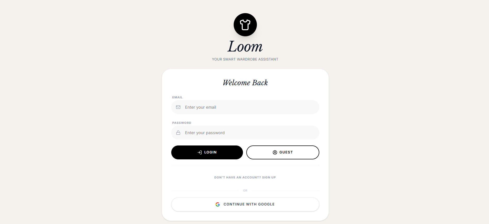
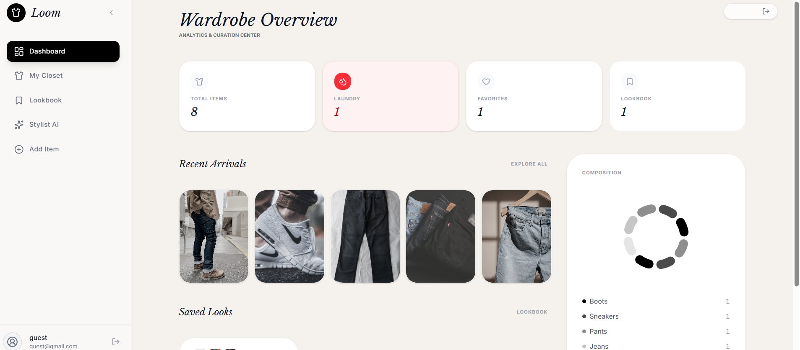
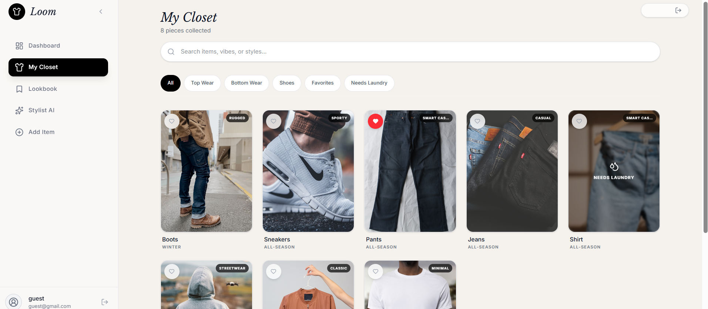

# Loom — Smart Wardrobe Assistant

> Digitize your closet, track what you wear, and let AI style your outfits.

Loom is a full-stack web app that helps you manage your wardrobe digitally. Take a photo of any clothing item, and Loom's AI will automatically classify it by type, color, formality, and season. When you need outfit help, the built-in Stylist AI picks a cohesive look from your closet based on the weather and occasion.

Built as a student project to explore AI integration, real-time databases, and responsive design.

---

## Features

- **AI Classification** — Snap a photo and Gemini AI identifies the category, colors, vibe, season, and formality score automatically.
- **Stylist AI** — Generates complete outfit suggestions (top + bottom + footwear) using color theory, weather, and occasion context.
- **Digital Closet** — Browse, search, and filter your wardrobe. Mark items as favorites or flag them for laundry.
- **Lookbook** — Save your favorite AI-generated outfits for later reference.
- **Wardrobe Analytics** — Visual breakdown of your closet composition with interactive charts.
- **Camera Capture** — Take photos directly from your device camera or upload from gallery.
- **Guest Mode** — Try the app instantly with pre-loaded sample items, no account needed.
- **Fully Responsive** — Works on phones, tablets, and desktops with a mobile-first design.

---

## Tech Stack

| Layer | Technologies |
|-------|-------------|
| Frontend | React 19, TypeScript, Vite, Tailwind CSS v4, Framer Motion |
| Backend | Node.js, Express |
| AI | Google Gemini 2.5 Flash (via GenAI SDK) |
| Database | Firebase Firestore (real-time sync) |
| Auth | Firebase Authentication (Email/Password, Google Sign-In) |
| Charts | Recharts |
| Deployment | Vercel (frontend) + Render (backend) |

---

## Project Structure

```
Loom/
├── src/
│   ├── components/      # React UI components
│   ├── hooks/           # Custom React hooks (useCloset, useOutfits)
│   ├── services/        # API clients & guest seeding logic
│   ├── lib/             # Firebase config, error utils, helpers
│   └── types/           # Shared TypeScript interfaces
├── server/
│   └── index.cjs        # Express backend (Gemini API proxy)
├── firestore.rules      # Firestore security rules
├── index.html           # Entry point
└── vite.config.ts       # Build configuration
```

---

## Screenshots



&nbsp;



&nbsp;



---

## How It Works

1. **Sign up** with email or Google, or try **Guest Mode** instantly.
2. **Add clothes** by taking a photo or uploading from gallery — AI classifies everything.
3. **Browse your closet** with filters for category, season, favorites, and laundry status.
4. **Ask the Stylist AI** to dress you for any occasion and weather.
5. **Save outfits** to your Lookbook for quick reference.

---

## Deployment

### Prerequisites
- Node.js 18+
- npm or yarn
- Firebase project with Firestore, Authentication, and Storage enabled
- Google Gemini API key

### Environment Setup

1. **Clone the repository**:
   ```bash
   git clone <repository-url>
   cd loom
   ```

2. **Install dependencies**:
   ```bash
   npm install
   ```

3. **Configure environment variables**:
   ```bash
   cp .env.example .env
   ```
   
   Edit `.env` with your configuration:
   ```
   GEMINI_API_KEY=your_gemini_api_key
   VITE_API_URL=http://localhost:5000
   GUEST_EMAIL=guest@loom.local
   GUEST_PASSWORD=your_secure_password
   PORT=5000
   NODE_ENV=development
   
   # Firebase config (from Firebase Console)
   VITE_FIREBASE_API_KEY=...
   VITE_FIREBASE_AUTH_DOMAIN=...
   VITE_FIREBASE_PROJECT_ID=...
   VITE_FIREBASE_STORAGE_BUCKET=...
   VITE_FIREBASE_MESSAGING_SENDER_ID=...
   VITE_FIREBASE_APP_ID=...
   ```

4. **Deploy Firestore Security Rules** (One-time setup):
   ```bash
   firebase deploy --only firestore:rules
   ```

5. **Deploy Firebase Storage Security Rules** (One-time setup):
   - Copy content from `firebase-storage.rules` 
   - Go to Firebase Console → Storage → Rules
   - Paste and publish

### Development

**Start development server** (frontend + backend):
```bash
npm run dev
```

This starts:
- Frontend: `http://localhost:3000` (Vite dev server)
- Backend: `http://localhost:5000` (Express server)

**Individual commands**:
```bash
npm run dev:frontend    # Vite dev server only
npm run dev:backend     # Express backend only
npm run typecheck       # TypeScript checking
npm run lint            # ESLint
npm run check           # Typecheck + Lint
```

### Building

**Production build**:
```bash
npm run build          # Build frontend + backend
npm run clean          # Clean build artifacts
```

**Preview production build**:
```bash
npm run preview
```

### Deployment Platforms

**Frontend (Vercel)**:
1. Connect repository to Vercel
2. Set environment variables in project settings
3. Deploy (automatic on push to main)

**Backend (Render)**:
1. Create new Web Service on Render
2. Connect GitHub repository
3. Set environment variables
4. Configure as Node.js with `npm run dev:backend`
5. Deploy

**Database (Firebase)**:
- Firestore and Storage automatically managed through Firebase Console
- Security rules deployed via `firebase deploy`

### Monitoring & Support

- **Errors**: Check browser console for frontend errors, Render logs for backend
- **Performance**: Monitor Firestore usage in Firebase Console
- **User Issues**: Check authentication logs and Firestore queries
- **API Limits**: Gemini API quota tracked in Google Cloud Console

---

## Future Improvements

- Outfit history & wear tracking
- Clothing donation suggestions for unused items
- Weather API integration for automatic weather detection
- Social sharing of Lookbook outfits
- PWA support for native app-like experience
- Unit & E2E test coverage
- Error tracking integration (Sentry)
- Analytics integration
- Performance monitoring

---

## License

Built as an educational project. Feel free to use and modify.

---

## Author

Built by **Aryan** 
